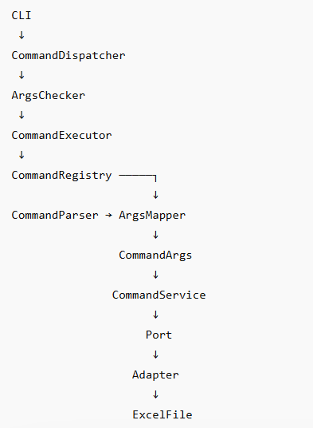

# 🧱 Système de Commandes – Architecture & Exécution

## 🎯 Objectif
Décrire les classes, leurs responsabilités et le flux d’exécution complet.

---

## 🧱 1. Les briques du système

### 🎬 Bootstrap
- **ExcelUtils** : point d’entrée Spring Boot
- **CommandDispatcher** : orchestration (log → validate → execute → handle)
- **ArgsChecker** : validation CLI via CommandSpecCatalog

---

### 🧠 Core
- **CommandExecutor** : coordonne parser + registry + service
- **CommandRegistry** : lookup des commandes
- **CommandParser** : transforme String[] → CommandArgs
- **CommandArgsMapper** : mapping spécifique par commande

---

### 🎯 Commandes
- **CommandService<T>** : interface
- Implémentations : AnalyzeTRX, DirectoryParser, etc.

---

### 🔌 Ports
- ExcelTransferPort
- CorrectionImputationPort

---

### 🔧 Infrastructure
- Adapters Excel / filesystem

---

### 🧩 Support
- CommandSpecCatalog
- ExitCodeHandler

---

## 🔄 2. Flux d’exécution

**---**

## 🧠 3. Vision globale

Architecture modulaire avec séparation claire :
- Bootstrap
- Application
- Ports
- Infrastructure

---

## 🚀 4. Prochaine étape
Aligner Parser et Registry pour un modèle unifié :
1 commande = 1 objet (nom + args + exécution)
